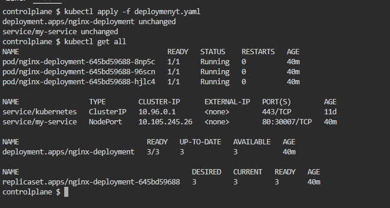

Kubernetes Deployment using docker images from private Jfrog Repository
-----------------------------------------------------------------------
* First create the Secrets using the command 
```bash
kubectl create secret docker-registry regcred \
--docker-server=krishna0527.jfrog.io \
--docker-username=krishna315283@gmail.com \
--docker-password=cmVmdGtuOjAxOjE3NTAzMjcxMzE6ZHVJSWh5Ukd4dWV6SXZZUFNzTWVvdlFLd2Qx \
--docker-email=krishna315283@gmail.com
```

* Created a secreat file 


* Basic Deployment yaml
```bash
apiVersion: apps/v1
kind: Deployment
metadata:
  name: nginx-deployment
  labels:
    app: nginx
spec:
  replicas: 3
  selector:
    matchLabels:
      app: nginx
  template:
    metadata:
      labels:
        app: nginx
    spec:
      containers:
      - name: nginx
        image: krishna0527.jfrog.io/gopi-docker/nginx:1.0
        ports:
        - containerPort: 80
      imagePullSecrets:
        - name: regcred
--- 
apiVersion: v1
kind: Service
metadata:
  name: my-service
spec:
  type: NodePort
  selector:
    app: nginx
  ports:
    - port: 80
      # By default and for convenience, the `targetPort` is set to
      # the same value as the `port` field.
      targetPort: 80
      # Optional field
      # By default and for convenience, the Kubernetes control plane
      # will allocate a port from a range (default: 30000-32767)
      nodePort: 30007
```
* Create the manifest file and apply 

* Access the application using nodeport
 
